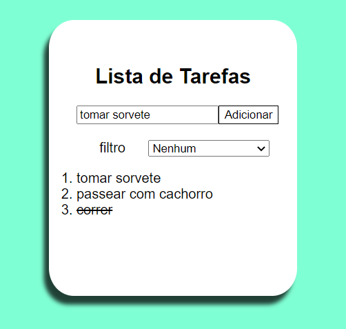

# Lista de Tarefas
Um pequeno projeto feito durante o curso da Labenu, agora com um estilo repaginado. 

Uma lista de tarefas simples com:
- Dois filtros(pendentes e concluídas)
- E possibilidade de criação e exclusão de tarefa

O resultado pode ser conferido => [aqui](https://taskdolist.netlify.app/)

